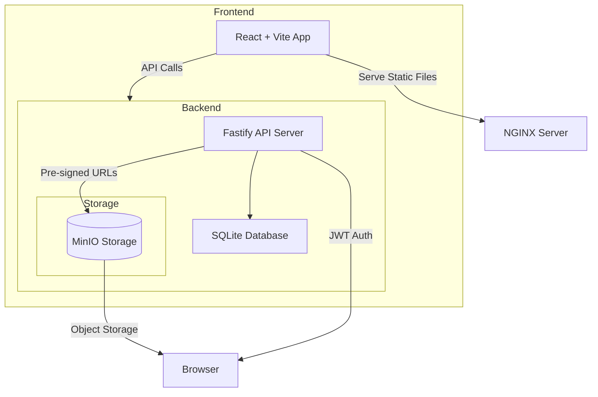

# Media Sharing Platform

- [Media Sharing Platform](#media-sharing-platform)
  - [Architecture](#architecture)
  - [Technologies Used](#technologies-used)
  - [Prerequisites](#prerequisites)
  - [Installation](#installation)
    - [1. Clone the Repository](#1-clone-the-repository)
    - [2. Set up Environment Variables](#2-set-up-environment-variables)
  - [Running locally with Docker Compose](#running-locally-with-docker-compose)
    - [1. Build the Containers](#1-build-the-containers)
    - [2. Access the Application](#2-access-the-application)
  - [Documentation](#documentation)

A full-stack media sharing application where users can upload, view, like, and delete media files. This project includes a **React** frontend, a **Fastify** backend, and **MinIO** as the storage server (compatible with AWS SDK). The backend is secured with JWT-based authentication.

## Architecture



## Technologies Used

- **Frontend**:
  - Built with React and TypeScript.
  - TailwindCSS for styling.

- **Backend**:
  - Node.js with Fastify (Scaffolded with `fastify-cli`).
  - JWT-based authentication.
  - Integrates with MinIO.
  - Uses `SQLite` for metadata storage;
  - Handles media file operations

- **Storage**:
  - MinIO for object storage (AWS S3 compatible).

- **Mobile**
  - Built with React Native using Expo

## Prerequisites

- Node.js (LTS)
- Docker & Docker Compose (for local deployment)
- MinIO server (or any S3-compatible object storage)

## Installation

### 1. Clone the Repository

```bash
git clone <repository-url>
cd media-sharing-platform
```

### 2. Set up Environment Variables

```env
# MinIO Configuration
S3_ACCESS_KEY=minioadmin
S3_SECRET_KEY=minioadmin
S3_ENDPOINT=http://localhost:9000
S3_REGION=us-east-1
BUCKET_NAME=media

# Fastify Configuration
FASTIFY_ADDRESS=0.0.0.0
FASTIFY_PORT=3000

# MISC
DATABASE_FILE_NAME=database.sqlite
JWT_SECRET=supersecret

```

> [!TIP]
> For ease of review, I've hardcoded the environment variables into the docker compose file
>
> Clone the repository and run the docker compose commands in the next section

## Running locally with Docker Compose

### 1. Build the Containers

```sh
docker-compose build
docker-compose up
```

### 2. Access the Application

- Frontend: `http://localhost`
- Backend: `http://localhost:3000`
- MinIO Console: `http://localhost:9000`

## Documentation

- Documentation is automatically generated using `@fastify/swagger` plugin, which uses JSON schemas, under the hood Fastify uses `ajv` to validate the schemas.
- Documentation is accessible at `http://localhost:3000/docs`

> [!NOTE]
> The mobile application is lacking in styling, but I will work on it to improve it.
>
> I've attempted various non-paid cloud deployment options such as `Fly.io` and `Vercel` but I wasn't impressed with the latency and the cold start so I decided to use Docker Compose instead.
>
> There is still a room for improvement in various aspects, I will try to work on them after my submission
