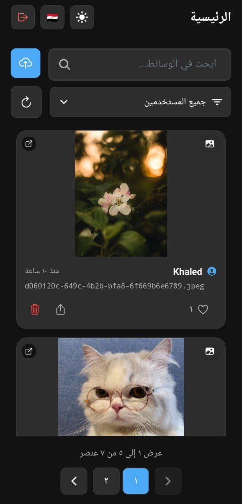

# Media Sharing Platform

[](https://github.com/nooreldeensalah/Minly_Assesment/actions/workflows/deploy-backend.yml)
[](https://github.com/nooreldeensalah/Minly_Assesment/actions/workflows/deploy-frontend.yml)

**Live Demo**: [Frontend](https://media-platform-frontend.fly.dev/) | [Backend API](https://media-platform-backend.fly.dev/)

- [Media Sharing Platform](#media-sharing-platform)
  - [Recent Updates](#recent-updates)
    - [v2.0.0 - Major Platform Overhaul](#v200---major-platform-overhaul)
  - [Features](#features)
    - [Core Features](#core-features)
    - [Advanced Features](#advanced-features)
  - [Architecture](#architecture)
  - [Technologies Used](#technologies-used)
    - [Frontend Stack](#frontend-stack)
    - [Mobile Stack](#mobile-stack)
    - [Backend Stack](#backend-stack)
    - [Storage \& Infrastructure](#storage--infrastructure)
    - [DevOps \& CI/CD](#devops--cicd)
  - [Prerequisites](#prerequisites)
  - [Quick Start](#quick-start)
    - [Web Application](#web-application)
    - [Mobile Application](#mobile-application)
  - [Mobile App Testing](#mobile-app-testing)
  - [Deployment](#deployment)
  - [Screenshots](#screenshots)
    - [Web Application Screenshot](#web-application-screenshot)
      - [Web Application Features](#web-application-features)
    - [Mobile Application Screenshot](#mobile-application-screenshot)
      - [Mobile Application Features](#mobile-application-features)
  - [API Documentation](#api-documentation)

A modern, full-stack media sharing platform with **React** frontend, **React Native** mobile app, and **Fastify** backend. Features include media upload/management, user authentication, real-time interactions, dark theme, Arabic internationalization, and cloud deployment with CI/CD.

## Recent Updates

### v2.0.0 - Major Platform Overhaul

- **UI/UX Revamp**: Complete redesign of frontend and mobile applications with modern, responsive interfaces
- **Dark Theme**: Full dark mode support with system preference detection
- **Arabic Internationalization**: Complete RTL support with Arabic localization
- **Cloud Deployment**: Production deployment on Fly.io with Tigris S3-compatible storage
- **CI/CD Pipeline**: Automated testing and deployment workflows
- **Enhanced Functionality**: Advanced search, filtering, and pagination capabilities
- **Canonical URLs**: Optimized image storage with proper URL management
- **Service Architecture**: Implemented proper abstraction layers and service patterns

## Features

### Core Features

- **JWT Authentication** - Secure user registration and login
- **Media Upload** - Support for images, gifs, and videos
- **Like System** - Interactive like/unlike functionality
- **Media Management** - Delete your own media files
- **Cross-Platform** - Web and mobile applications

### Advanced Features

- **Real-time Search** - Instant search across media files
- **Advanced Filtering** - Filter by user, media type, and more
- **Pagination** - Efficient content loading with navigation
- **Theme Support** - Light/dark mode with system preference
- **Internationalization** - English and Arabic with RTL support
- **Cloud Storage** - Scalable storage with S3 compatibility
- **API Documentation** - Auto-generated Swagger documentation

## Architecture


## Technologies Used

### Frontend Stack

- **React 18** with TypeScript and Vite
- **TailwindCSS** for responsive styling
- **React Query** for state management
- **React Hook Form** for form handling
- **i18next** for internationalization

### Mobile Stack

- **React Native** with Expo SDK 52
- **TypeScript** for type safety
- **Expo Router** for navigation
- **React Native Reanimated** for animations
- **Expo AV** for media playback

### Backend Stack

- **Node.js** with Fastify framework
- **TypeScript** for type safety
- **JWT** for authentication
- **SQLite** with type-safe queries
- **Fastify Plugins** ecosystem

### Storage & Infrastructure

- **Tigris**/**MinIO**  S3-compatible object storage
- **Fly.io** for cloud deployment
- **Docker** for containerization
- **NGINX** for static file serving

### DevOps & CI/CD

- **GitHub Actions** for automated deployment
- **ESLint & Prettier** for code quality
- **Swagger/OpenAPI** for API documentation

## Prerequisites

- Node.js 18+ (LTS recommended)
- Docker & Docker Compose (for local development)
- Expo CLI (for mobile development)
- Git

## Quick Start

### Web Application

Visit the live demo: **[https://media-platform-frontend.fly.dev/](https://media-platform-frontend.fly.dev/)**

### Mobile Application

1. Install **Expo Go** on your mobile device
2. Use the `.env.example` configuration to test against the deployed backend
3. Run `npm install && npm start` in the `mobile/` directory
4. Scan the QR code with Expo Go

## Mobile App Testing

To test the mobile application with the deployed backend:

1. **Install Expo Go** on your mobile device from the App Store or Google Play

2. **Clone the repository:**

   ```bash
   git clone https://github.com/nooreldeensalah/Minly_Assesmentt
   cd Minly_Assesmentt/mobile
   ```

3. **Install dependencies:**

   ```bash
   npm install
   ```

4. **Configure environment:**

   ```bash
   cp .env.example .env
   # The .env.example already contains the deployed backend URL
   ```

5. **Start the development server:**

   ```bash
   npm start
   ```

6. **Test on your device:**
   - Scan the QR code displayed in the terminal with Expo Go
   - The app will connect to the deployed backend automatically

## Deployment

The platform is deployed on **Fly.io** with automated CI/CD:

- **Frontend**: Deployed with NGINX static file serving
- **Backend**: Deployed with Node.js runtime
- **Storage**: Tigris S3-compatible object storage
- **CI/CD**: GitHub Actions for automated testing and deployment

**Live URLs:**

- [Frontend Application](https://media-platform-frontend.fly.dev/)
- [Backend API](https://media-platform-backend.fly.dev/)

## Screenshots

### Web Application Screenshot


#### Web Application Features

Modern, responsive interface with dark theme support and Arabic internationalization

### Mobile Application Screenshot



#### Mobile Application Features

Native mobile experience with Expo and React Native

## API Documentation

- **Auto-generated documentation** using `@fastify/swagger` plugin
- **JSON Schema validation** with Fastify's built-in `ajv` validator
- **Interactive API explorer** available at `/docs` endpoint

**Access documentation:**

- **Local**: `http://localhost:3000/docs`
- **Production**: `https://media-platform-backend.fly.dev/docs`
